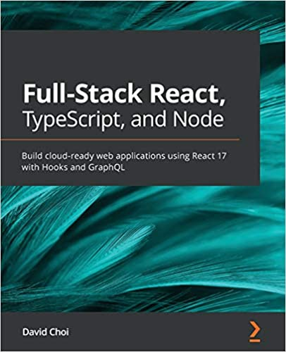

> My notes from the book "Full-Stack React, TypeScript, and Node: Build cloud-ready web applications using React 17 with Hooks and GraphQL"

***

# Section 1: Understanding TypeScript and How It Can Improve Your JavaScript

This section gives you an overview of the benefits of TypeScript and its most important language features. We will also cover what the most important features of ES6 are, and how we can improve code quality and readability.

This section comprises of the following chapters:
- [Chapter 1, Understanding TypeScript](https://github.com/alanapapa/HandsOnTypeScript/tree/master/Chap1)
- [Chapter 2, Exploring TypeScript](https://github.com/alanapapa/HandsOnTypeScript/tree/master/Chap2)
- [Chapter 3, Building Better Apps with ES6+ Features](https://github.com/alanapapa/HandsOnTypeScript/tree/master/Chap3)

***

# Section 2: Learning Single-Page Application Development Using React

In this section, we will learn how to set up and build a React web application.

This section comprises of the following chapters:
- Chapter 4, Learning Single-Page Application Concepts and How React Enables Them
- Chapter 5, React Development with Hooks
- Chapter 6, Setting Up Our Project Using create-react-app and Testing with Jest
- Chapter 7, Learning Redux and React Router

***

